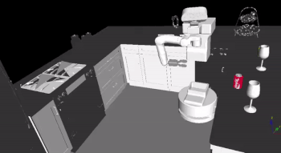

# ROS client for Flexibly configuring task and motion planning problems

A planning framework for both levels of planning that includes an easy way to configure their interconnection. Motion planning is done using The Kautham Project, which is equipped with the Open Motion Planning Library suite of sampling-based motion planners,and task planning is done using the Fast Forward task planner. Both planning levels
are acessible through Robotic Operating System interfaces using services. A client program then uses these task and motion planning services and an XML configuration file that defines the linkage between symbolic actions and geometric values, to compute the sequence of feasible robot motions that allow to successfully execute a manipulation task.

## Requirements

- ROS Melodic with Python 3
- The Kautham Project (tamp branch)
- FF Planner
- GraspIt

## Installing

### ROS Melodic Python 3

Guide to install ROS Melodic can be found [here](https://sir.upc.edu/projects/rostutorials/)

#### Installing the basic libraries for Python 3

Run the following commands in a terminal window
Installing Python 3  files:

```
$ sudo apt install -y python3 python3-dev python3-pip build-essential python3-yaml
$ sudo install rosdep rospkg rosinstall_generator rosinstall wstool vcstools catkin_tools catkin_pkg
```

Initializing it

```
$ sudo rosdep init
$ rosdep update
```

## Setting up workspace for ROS

Create workspcace

```
$ sudo mkdir <workspace-name>
$ cd <workspace-name>
$ sudo mkdir src
```

### The Kautham Project

Clone the tamp branch of The Kautham Project in the `src` directory of your workspace

```
$ git clone --single-branch --branch=tamp https://gitioc.upc.edu/kautham/kautham.git
```

Build Kautham

```
$ mkdir build
$ cd build
$ cmake ..
$ make
```

### Task and motion planning repository

Clone the meta respository in the `src` directory of your workspace

```
$ git clone https://gitioc.upc.edu/rostutorials/task_and_motion_planning.git
$ cd task_and_motion_planning
$ git checkout python-branch
$ git submodule init
$ git submodule update
$ git submodule status
```
### Tiago arm kinematics

Clone the respository in the `src` directory of your workspace

```
git clone -single-branch --branch=python-branch https://gitioc.upc.edu/robots/kinenik.git
```

### Intalling GraspIt-Ros

Dependencies
```
$ sudo apt-get install libqt4-dev
$ sudo apt-get install libqt4-opengl-dev
$ sudo apt-get install libqt4-sql-psql
$ sudo apt-get install libcoin80-dev
$ sudo apt-get install libsoqt4-dev
$ sudo apt-get install libblas-dev
$ sudo apt-get install liblapack-dev
$ sudo apt-get install libqhull-dev
$ sudo apt-get install libeigen3-dev
```
Graspit Installation
```
$ git clone git@github.com:graspit-simulator/graspit.git
$ cd graspit
$ export GRASPIT=$PWD
$ mkdir build
$ cd build
$ cmake ..
$ make -j5
$ sudo make install 
```

Setting Up Environment Variable
Graspit environment variable is added to the *bashrc* file using the following command
```
echo "export GRASPIT=<directory that contains model and world folder>" >> ~/.bashrc    
source ~/.bashrc
```

It will permanently setup the graspit environment variable. And needs to be set according to the example being used.

Compiling the Graspit_ros Node

```
mkdir -p graspit_ws/src
cd graspit_ws
catkin_make
source devel/setup.bash
cd src
git clone https://github.com/Muhayyuddin/GraspIt-RosNode.git
cd ..
catkin_make
```

## Build workspace

```
$ catkin build
$ source devel/setup.bash
```

# Running the example
#### Tiago-kitchen example with robot configuration

To run the Tiago-Kitchen example

```
$ roslaunch ktmpb tiago_kitchen.launch
```

###### Making changes to the task and motion planning problem

The`tampconfig.xml` file can be modified for creating different instances of the maniulation tasks.

#### Tiago-Kitchen example with Position of the the object
<sup>Tiago arm kinamatics package needs to be installed </sup>
Make changes in the`tampconfig.xml` file accordingly:
- Comment or remove the Graspcontrols tags
- Uncomment the Pose tag to use obstacle position to Pick the object
- Uncomment the Poseregion tag to set a region to Place the object

To run the Tiago-Kitchen example with position
```
$ roslaunch ktmpb tiago_kitchen.launch
```

#### Verify with Kautham GUI
To run the Kautham GUI and verify the solution
```
$ roslaunch ktmpb kautham_gui.launch
```

- Open the `tiago_mobile_counterA_counterB.xml` problem in the Kautham GUI
- Load the taskfile `taskfile_tampconfig.xml`
- Click on start move



